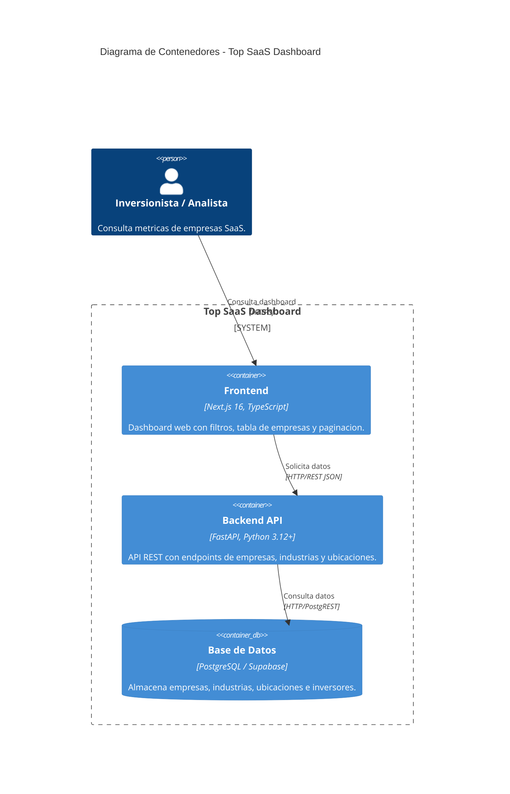

# Diagrama C4 - Nivel 2: Contenedores del Sistema

## Descripcion

Este diagrama muestra los contenedores que componen el sistema **Top SaaS Dashboard** y sus interacciones.

### Contenedores

| Contenedor | Tecnologia | Responsabilidad |
|---|---|---|
| **Frontend** | Next.js 16 (React, TypeScript) | Interfaz web del dashboard. Renderiza tabla de empresas, filtros y paginacion. Server Components para data fetching. |
| **Backend API** | FastAPI (Python 3.12+) | API REST que expone endpoints de empresas, industrias y ubicaciones con filtros y paginacion. |
| **Base de datos** | PostgreSQL (Supabase) | Almacena datos de empresas SaaS, industrias, ubicaciones e inversores. Acceso via PostgREST. |

### Protocolos de comunicacion

- **Frontend → Backend API**: HTTP/REST (JSON) por puerto 8000
- **Backend API → Base de datos**: HTTP/PostgREST via SDK de Supabase

## Diagrama

