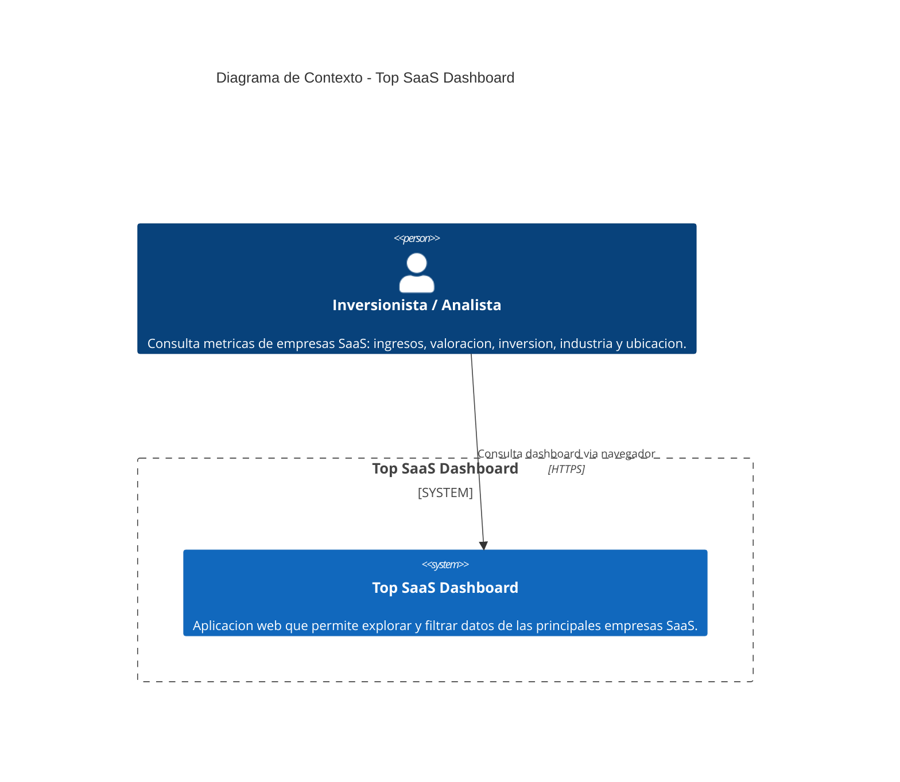

# Diagrama C4 - Nivel 1: Contexto del Sistema

## Descripcion

Este diagrama muestra la vista de contexto del sistema **Top SaaS Dashboard**. Representa al actor externo (Inversionista/Analista) y su interaccion con el sistema como un todo.

- **Inversionista/Analista**: usuario que consulta el dashboard para evaluar metricas de empresas SaaS (ingresos, valoracion, inversion, industria, ubicacion).
- **Top SaaS Dashboard**: sistema compuesto por Frontend (Next.js), Backend API (FastAPI) y Base de datos (PostgreSQL en Supabase). El usuario interactua con el sistema via navegador web para consultar y filtrar datos de empresas.

## Diagrama

