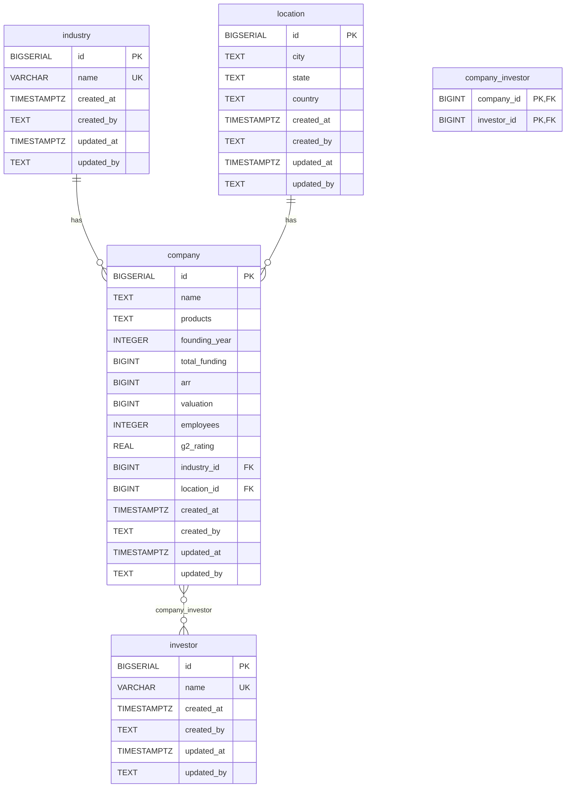

# Diagrama Entidad-Relacion - Top SaaS Database

## Descripcion del modelo de datos

El modelo almacena informacion de las principales empresas SaaS, sus industrias, ubicaciones e inversores.

### Entidades

| Entidad | Descripcion |
|---|---|
| **company** | Empresa SaaS con metricas financieras (funding, ARR, valuation) y operativas (employees, g2_rating). |
| **industry** | Industria/sector al que pertenece una empresa. Nombre unico (UNIQUE). |
| **location** | Ubicacion geografica (city, state, country). |
| **investor** | Inversor asociado a empresas. Nombre unico (UNIQUE). |
| **company_investor** | Tabla de asociacion many-to-many entre company e investor. PK compuesta. |

### Cardinalidad de relaciones

- `company` many-to-one `industry`: cada empresa pertenece a una industria (opcional).
- `company` many-to-one `location`: cada empresa tiene una ubicacion (opcional).
- `company` many-to-many `investor`: una empresa puede tener multiples inversores y un inversor puede invertir en multiples empresas (via `company_investor`).

### Convenciones de tipos de datos

- **BIGSERIAL**: primary keys con auto-incremento.
- **BIGINT**: valores monetarios (total_funding, arr, valuation) en dolares.
- **INTEGER**: valores numericos menores (founding_year, employees).
- **REAL**: valores decimales (g2_rating).
- **TEXT / VARCHAR(255)**: cadenas de texto; VARCHAR con UNIQUE para catalogos.
- **TIMESTAMPTZ**: campos de auditoria (created_at, updated_at) con timezone.

### Indices

- `idx_company_industry` en `company(industry_id)`
- `idx_company_location` en `company(location_id)`
- `idx_company_investor_company` en `company_investor(company_id)`
- `idx_company_investor_investor` en `company_investor(investor_id)`

### Triggers

- `update_updated_at_column()`: funcion que actualiza `updated_at = NOW()` antes de cada UPDATE en las 4 tablas principales.

### Hallazgos

El esquema esta completo y consistente. No se requieren migraciones adicionales.

## Diagrama

